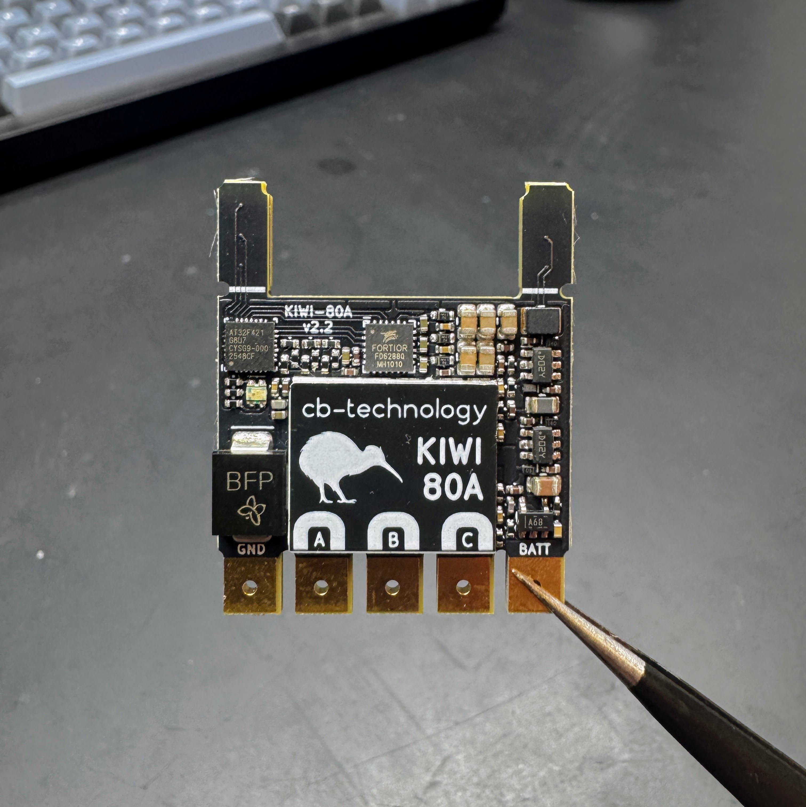
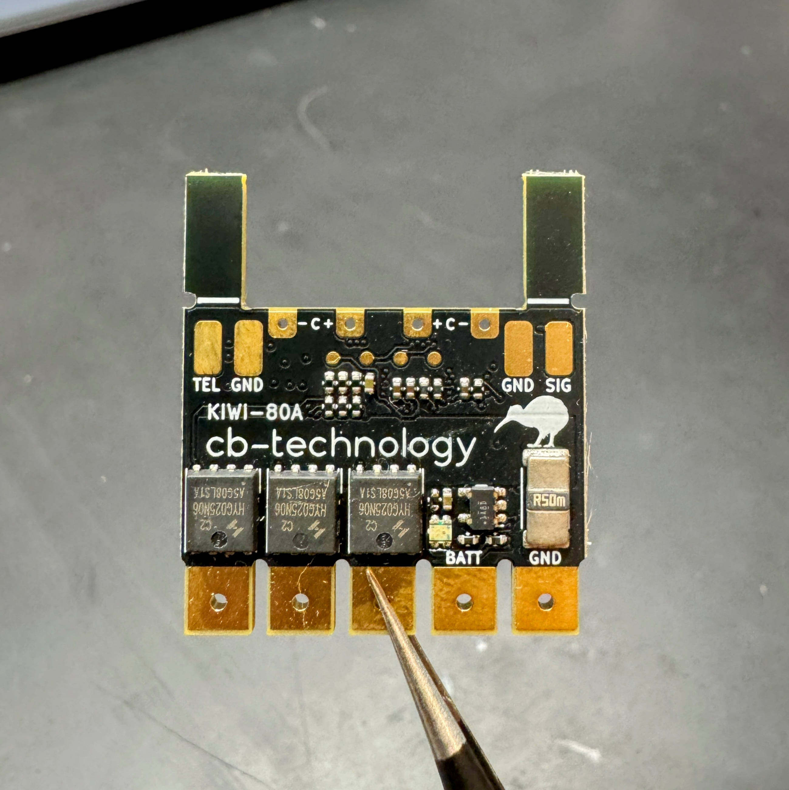
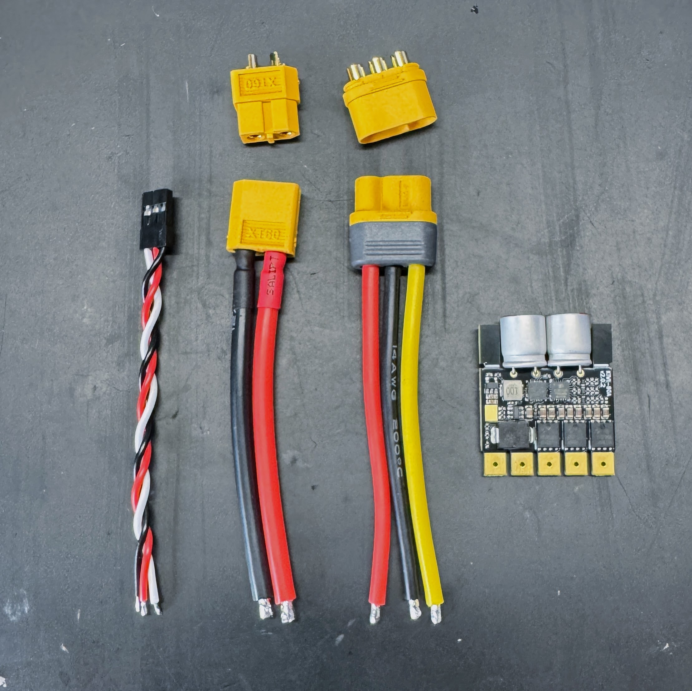

# KIWI - 80A v2.0

  

The KIWI is a compact and powerful brushless speed controller purpose-built for combat robotics It runs AM32 firmware: offering smooth throttle response, dynamic braking, and configurability via a standard USB serial dongle, ready to drop into any serious robot build.

The product is named after the [Kiwi](https://en.wikipedia.org/wiki/Kiwi_(bird)), the iconic flightless bird and national symbol of New Zealand. Fiercely territorial, it has powerful legs strong enough to outrun a person, and can live for several decades in the wild.

Developed, assembled, and tested in [Christchurch, New Zealand](https://www.google.co.nz/maps/place/Christchurch+New+Zealand), by Connor Benton.

## FEATURES

- Single configurable brushless motor output.
- All high-power I/O are along one edge, making it ideal to tuck into a corner of your robot.
- Status RBG LED to indicate run and fault modes.
- Large TVS diode to protect against voltage spikes.
- Configurable under-voltage, over-current, over-temperature, and stall detection protections.
- KISS standard telemetry output to allow real-time monitoring during usage.
- Sinusoidal startup mode
- Easy-to-solder bulk decoupling capacitor pads.

## SPECIFICATIONS

- **Dimensions:** 30x36x10mm *incl capacitors*
- **Weight:** 9g
- **Voltage Input:** 2-8S LiPo (6.0-33.6V)
- **Current Output:** 80A  
- **Signal Input:** DShot (300/600), PWM, OneShot, Multishot
- **AM32 Version:** [v2.20](https://github.com/am32-firmware/AM32/releases/tag/v2.20)

## PACKAGE INCLUDES

- 1x KIWI-80A ESC
- 2x Polymer Capacitors
- 1x XT60 Battery Input Cable
- 1x XT60 Mating Connector
- 1x MR60 Motor Ouput Cable
- 1x MR60 Mating Connector
- 1x 3p DuPoint Signal Cable

## CONFIGURATION 

### AM32 Configurator Tool
 - [Online Configurator](https://am32.ca/configurator)
 - [Download Desktop Configurator](https://am32.ca/downloads)

### AM32 Configurator Process

1. Connect the KIWI to the Computer through the USB Linker.
2. Power ON the ESC.
3. Open up the Configurator on the computer:
    - `Port Select` the USB linker COM port.
    - `Connect` to the ESC.
    - `Read` the settings.
    - Update to your chosen settings.
    - `Save` the settings.
    - `Disconnect` from the ESC.
7. Power OFF the ESC and unplug.
8. Test the ESC is operating as expected.
10. Kick some bot.

### AM32 Configuration Settings
[Configurator Setting Explained](https://www.youtube.com/watch?v=wwYyp74oLa0&list=PLrxUiYCo7HwrIz1uE0aIfNT4GUgVMwc1t)

| Setting | Description | 
|--|--|
| Reverse Rotation | Reverses the rotation direction of the motor. Although, normally this would just be done by swapping two of the motor phase wires. |
| 3D Mode | Allows the motor to rotate in both directions. The throttle range is divided between forward and reverse directions, where the centre stick position is neutral.  |  
| Complementary PWM | Apples PWM to the complementary output during the PWM OFF time. This acts as a brake slowing the motor when going from a higher duty cycle to lower duty cycle. |  
| PWM Frequency | Sets the switching frequency of the MOSFETSs when using PWM. |
| Variable PWM | Switches MOSFETS with automatic PWM timing based on the motor RPM. This is to avoid PWM frequency/commutation frequency interference. |
| Timing Advance | Commutate the motor by this many degrees advanced of neutral. Usually this is set to 15°. |
| Motor KV | Set to the approximate kV of your motor. Throttle is restricted at low RPMs based on the kV value selected. |
| Motor Poles | Set to the number of poles your motor has. This adjusts the sine mode speed in order to match the minimum speed after changeover to standard trapezoidal PWM. |
| Startup power | Defines the the minimum duty cycle level and boost power used for the first few commutations. |
| Stuck Rotor Protection | When the ESC detects the motor is stuck, it will 'give up' trying to turn the motor until the throttle returns to the neutral position.  This setting is primarily designed for quads and should be disabled in cars/rock crawlers as the ESC will give up when trying to get over a difficult obstacle. |
| Stall Protection | When the motor is loaded up and is going to stop, the ESC will push some more to prevent stopping. This is good for cars/crawlers. |
| 30ms Telemetry | Enables the telemetry output at a 30ms interval using the KISS telemetry protocol. |
| Use Hall Sensors | Not currently used. |
| Beep Volume | How loud the esc will beep. |
| Brake on Stop | Enables braking when the motor is not spinning. Good for cars/crawlers. |
| Stopped Brake Level | Defines the level of braking force applied when the motor is stopped.  |
| Running Brake Level | Defines the level of braking force applied while the motor is still spinning. Useful to reduce this if using large propellers and you do not want to stress the motor. Useful in rock crawlers to avoid performing endos. |
| Sinusoidal Startup | Enables slow startup mode that is good for crawlers. | 
| Sine Startup Range | The amount of throttle range dedicated to using sine mode. |
| Sine Mode Power | The amount of torque used while in sine mode.  This setting should be adjusted with care. Higher values can result in a lot of heat being generated |

## DISCLIAMER

This product, and all other cb-technology products, are intended for use in hobby projects, and for educational and experimental uses. These devices are not suitable for any application where human life or health or significant property value depend on their proper operation. cb-technology ltd are not responsible for any loss or damage incurred by the operation or failure of this product or any others. The specifications listed are accurate to the best of our knowledge but are not guaranteed in any way. The buyer assumes all responsibility for proper use, testing, and verification of this unit in any application. cb-technology ltd liability is limited to replacement of defective DOA units. By installing and using this unit you are agreeing to these terms. If you do not agree you may return any unused units for a refund.
