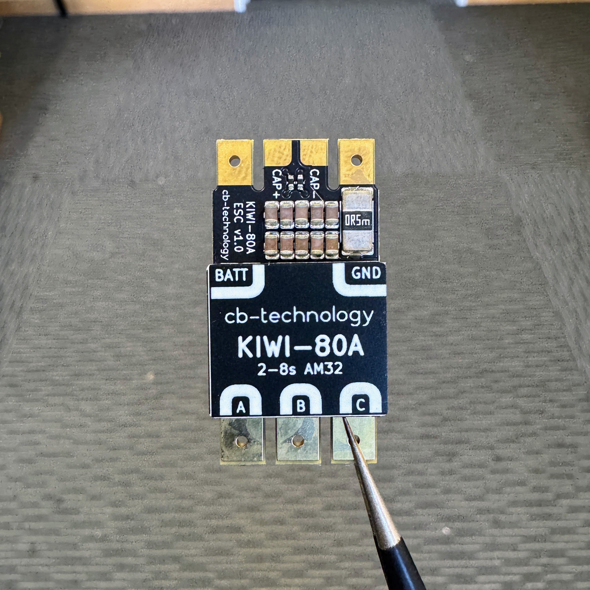

# KIWI - 80A v1.0 *beta*

  

The KIWI is a compact and powerful brushless speed controller (BLDC ESC), purpose-built for combat robotics and ideal for any high-demand application requiring precise, high-current motor control. It runs AM32 firmware, offering smooth throttle response, dynamic braking, and configurability via standard serial protocols, ready to drop into any serious robot build.

The product is named after the [Kiwi](https://en.wikipedia.org/wiki/Kiwi_(bird)), the iconic flightless bird endemic to New Zealand.

Developed, assembled, and tested in [Christchurch, New Zealand](https://www.google.co.nz/maps/place/Christchurch+New+Zealand), by Connor Benton.

NOTE:
*We have found an issue with some of the initial batch that caused the incorrect FW version to be loaded on from the factory. Please check all v1.0 ESC's to ensure they are up to the latest version (v2.19). FW binaries are avalible for downlaod from the FW folder in this repository.*

## FEATURES

- Single brushless motor output.
- Configurable Uni-Directional or Bi-Directional output.
- Status RBG LED to indicate run mode, fault and calibration.
- Configurable under-voltage, over-current, over-temperature, and stall detection protections.
- KISS standard telemetry output to allow real-time monitoring during usage.
- Sinusoidal startup mode
- Easy-to-solder bulk decoupling capacitor pads.
- Failsafe checks for loss of connection with radio.

## SPECIFICATIONS

- **Dimensions:** 35x18x9mm *incl heatsink*
- **Weight:** 9g *bare*, 14g *incl provided capacitor+wires*
- **Voltage Input:** 2-8S LiPo (6.0-33.6V)
- **Current Output:** 80A  
- **Signal Input:** DShot (300/600), PWM, OneShot, Multishot
- **AM32 Version:** [v2.19](https://github.com/am32-firmware/AM32/releases/tag/v2.19)

## PACKAGE INCLUDES

- 1x KIWI-80A ESC w/ heatsink
- 1x 35V 470uF capacitor
- 1x 90mm 16AWG power input cable *\*pair\**
- 1x 90mm 3p DuPoint signal input cable

## CONFIGURATION 

### What You'll Need

1. KIWI-80A
2. Power Supply *\*or\** Battery
3. Soldering Iron
4. [AM32 USB Linker/Programmer](https://www.aliexpress.com/item/1005008428191505.html?spm=a2g0o) *\*or\** [reuse a spare Arduino](https://github.com/AlkaMotors/AM32-MultiRotor-ESC-firmware/wiki/Arduino-PC-Link)
5. Computer w/ access to the AM32 Configurator

### Hardware Setup

1. Connect the KIWI to the Computer through the USB Linker.
2. Power ON the ESC.
3. Open up the Configurator on the computer:
    - `Port Select` the USB linker COM port.
    - `Connect` to the ESC.
    - `Read` the settings.
    - Update to your chosen settings.
    - `Save` the settings.
    - `Disconnect` from the ESC.
7. Power OFF the ESC and unplug.
8. Test the ESC is operating as expected.
10. Kick some bot.

### AM32 Configurator Tool
 - [Online Configurator](https://am32.ca/configurator)
 - [Download Desktop Configurator](https://am32.ca/downloads)

### AM32 Configuration Settings
[Configurator Setting Explained](https://www.youtube.com/watch?v=wwYyp74oLa0&list=PLrxUiYCo7HwrIz1uE0aIfNT4GUgVMwc1t)

| Setting | Description | Effect |
|--|--|--|
|Reverse Rotation|Reverse the rotation of the motor direction, normally this would just be done by swapping two of the motor wires|motor rotates in opposite direction|
|Complementary PWM|Apples to pwm to the complementary output during the pwm Off time. This acts as a brake slowing the motor when going from a higher duty cycle to lower duty cycle||
|Variable PWM|ESC FETs will be switched with automatic PWM timing based on the motors rpm. This is to avoid pwm frequency/commutation frequency interference||
|Bi-Directional (fwd/rv)|Used for cars, normally crawlers. Throttle range is divided between forward and reverse where centre stick position is neutral||
|Stuck Rotor Protection|This setting is primarily designed for quads.  When the esc detects the motor is stuck it will 'give up' trying to turn the motor until the throttle returns to the neutral position.  This should be disabled in rock crawlers as the esc will give up when trying to get over a difficult obstacle|Detects a stuck rotor and stops turning the motor until zero throttle|
|Brake on Stop|Apply brake when the motor is not spinning|Motor will actively brake when it is not turning. Good for Crawlers|
|Stall Protection|When the motor on load is going to stop, the esc will push some more  to prevent stopping|Good for crawlers|
|Sinusoidal Startup|Slow mode startup :)|Good for Crawlers|
|30ms Telemetry|Enables a serial telemetry output on a 30ms interval using the Kiss telemetry protocol||
|Use Hall Sensors|Not currently used use to lack of hall sensor capable targets||
|Timing Advance|Commutate the motor by this degree advance of neutral 0 timing ||
|Motor KV|Set the approximate of KV of your motor, throttle is restricted at low rpms based on the kv value selected||
|Motor Poles|Set to the number of poles your motor has. This adjusts the sine mode speed in order to match the minimum speed after changeover to standard trapezoidal pwm||
|Startup power|Defines the The minimum duty cycle level and boost power used for the first few commutations||
|PWM Frequency|The switching frequency of the mosfets when using PWM||
|Beep Volume|How loud the esc will beep|Changes the volume of the beep|
|Stopped Brake Level|The braking force that will be used when the motor is stopped. Useful in crawlers vehicles if you want the car to creep down a hill.||
|Sine Startup Range|The amount of throttle range to dedicate to using Sine mode. With less number motor start spin at a higher RPM |The throttle will stay in sine mode for more/or less time|
|Sine Mode Power|The amount of torque used while in sine mode.  This setting should be adjusted with care. Higher values can result in a lot of heat being generated||
|Running Brake Level|The force used to brake the motor when it is still spinning. Useful to reduce this if using large propellers and you do not want to stress the motor. Useful in rock crawlers to avoid performing endos |More or less brake force will be applied to the motor while still rotating|

## DISCLIAMER

This product, and all other cb-technology products, are intended for use in hobby projects, and for educational and experimental uses. These devices are not suitable for any application where human life or health or significant property value depend on their proper operation. cb-technology ltd are not responsible for any loss or damage incurred by the operation or failure of this product or any others. The specifications listed are accurate to the best of our knowledge but are not guaranteed in any way. The buyer assumes all responsibility for proper use, testing, and verification of this unit in any application. cb-technology ltd liability is limited to replacement of defective DOA units. By installing and using this unit you are agreeing to these terms. If you do not agree you may return any unused units for a refund.
